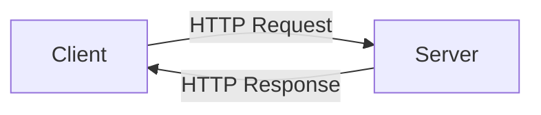

# Docusaurus 3 — MDX Pitfalls and URL Conventions

Practical knowledge for generating content that compiles and renders correctly in the project's Docusaurus 3 site. This is not a Docusaurus tutorial — it covers the specific pitfalls and conventions relevant to this project's content generation.

## The MDX Pitfall

### The Problem

Docusaurus 3 uses MDX v3 to compile Markdown files. MDX parses content as a mix of Markdown and JSX. This means that a bare `<` character followed by an alphanumeric character is interpreted as the opening of a JSX tag, not as a less-than sign or prose.

This will **break compilation**:

```markdown
If x < 10, the function returns early.
```

MDX reads `< 10` and sees... actually, that specific example works because there is a space after `<`. The problem occurs when `<` is immediately followed by a letter or number with no space:

```markdown
Use the <select> element for dropdowns.
Compare <String> and <Number> types.
Protocols like <http://example.com> are common.
```

Each of these will cause an MDX compilation error because MDX interprets `<select>`, `<String>`, `<Number>`, and `<http:` as JSX component tags.

### Solutions

**Option 1 — Code spans (preferred for technical terms):**
```markdown
Use the `<select>` element for dropdowns.
Compare `<String>` and `<Number>` types.
```
Content inside backtick code spans is not parsed as JSX. This is the cleanest solution for technical terms, HTML elements, and type parameters.

**Option 2 — HTML entities:**
```markdown
Use the &lt;select&gt; element for dropdowns.
```
Works but harder to read in source. Use when code spans are inappropriate (e.g., inside headings or where inline code styling is undesirable).

**Option 3 — Prose alternatives:**
```markdown
If x is less than 10, the function returns early.
```
Rewrite to avoid the character entirely. Best for prose where the `<` symbol is not essential.

**Option 4 — Escaping with backslash:**
```markdown
Use the \<select\> element for dropdowns.
```
Works in some MDX configurations but behaviour can be inconsistent. Prefer options 1-3.

### Where This Bites You

- **Generic type parameters**: `Array<string>`, `Map<K, V>`, `Promise<Result>` — always wrap in code spans
- **HTML element names in prose**: "the `<div>` element" — always wrap in code spans
- **Comparison operators in prose**: "if x < y" — add a space after `<` or use "less than"
- **URLs in angle brackets**: `<https://example.com>` — use normal Markdown links instead
- **Email addresses**: `<user@example.com>` — use code spans or normal text
- **Mathematical expressions**: "for all n < k" — use prose or LaTeX if available

### Automated Check

Before generating any module content, mentally scan for bare `<` followed by `[a-zA-Z0-9]`. If found, apply one of the solutions above.

## File Naming Conventions

### Module Files

Format: `X.Y-slug.md`

- `X` = section number (1-indexed)
- `Y` = module number within the section (1-indexed)
- `slug` = kebab-case descriptive name

Examples:
- `1.1-what-is-http.md`
- `1.2-request-response-cycle.md`
- `2.1-setting-up-express.md`
- `3.4-error-handling-patterns.md`

### Section Directories

Format: `NN-section-name/`

- `NN` = two-digit numeric prefix (01, 02, 03...)
- `section-name` = kebab-case descriptive name

Examples:
- `01-fundamentals/`
- `02-building-apis/`
- `03-advanced-patterns/`

Docusaurus automatically strips the numeric prefix from URLs. So `docs/01-fundamentals/1.1-what-is-http.md` renders at the URL path `/docs/fundamentals/1.1-what-is-http`.

### Why the Numeric Prefix?

Docusaurus uses file system order for sidebar ordering by default. Numeric prefixes guarantee consistent ordering across operating systems (some file systems sort differently). The `sidebar_position` frontmatter field provides an override, but the file naming convention serves as both a fallback and a visual aid when browsing the file system.

## Frontmatter

Every module file must include YAML frontmatter:

### Required Fields

```yaml
---
sidebar_position: 1
sidebar_label: "What is HTTP?"
title: "What is HTTP? — Understanding the Protocol"
---
```

- **`sidebar_position`**: Integer. Controls ordering in the sidebar. Should match the `Y` in the `X.Y` module ID.
- **`sidebar_label`**: Short label displayed in the sidebar. Typically the module title without the section context.
- **`title`**: Full page title. Can be longer and more descriptive than the sidebar label. Rendered as the `<h1>` and in the browser tab.

### Optional Fields

```yaml
---
sidebar_position: 1
sidebar_label: "What is HTTP?"
title: "What is HTTP? — Understanding the Protocol"
description: "Learn what HTTP is, how it works, and why it matters for web development."
keywords: [http, protocol, web, request, response]
diataxis_type: explanation
---
```

- **`description`**: Used for SEO `<meta>` description and link previews. One sentence.
- **`keywords`**: Array of keywords for SEO. Optional but helpful.
- **`diataxis_type`**: Custom field used by the training delivery engine to adapt delivery style. One of: `tutorial`, `how-to`, `explanation`, `reference`.

## Category Files

Each section directory must contain a `_category_.json` file that configures how the section appears in the sidebar.

```json
{
  "label": "Fundamentals",
  "position": 1,
  "collapsible": true,
  "collapsed": true
}
```

- **`label`**: The section name displayed in the sidebar.
- **`position`**: Integer ordering among sibling sections.
- **`collapsible`**: Whether the section can be collapsed in the sidebar. Always `true`.
- **`collapsed`**: Whether the section starts collapsed. Set to `true` for all sections except the first (which should be `false` so the learner sees where to start).

### Example Directory Structure

```
docs/
├── 01-fundamentals/
│   ├── _category_.json          # {"label": "Fundamentals", "position": 1, ...}
│   ├── 1.1-what-is-http.md
│   ├── 1.2-request-response.md
│   └── 1.3-status-codes.md
├── 02-building-apis/
│   ├── _category_.json          # {"label": "Building APIs", "position": 2, ...}
│   ├── 2.1-express-setup.md
│   ├── 2.2-routing.md
│   └── 2.3-middleware.md
└── 03-advanced-patterns/
    ├── _category_.json          # {"label": "Advanced Patterns", "position": 3, ...}
    ├── 3.1-authentication.md
    └── 3.2-rate-limiting.md
```

## Mermaid Diagrams

Docusaurus supports Mermaid diagrams via `@docusaurus/theme-mermaid`. Use fenced code blocks with the `mermaid` language identifier:

````markdown

````

### Supported Diagram Types

- `graph` / `flowchart` — Flow diagrams (most commonly used)
- `sequenceDiagram` — Interaction sequences (good for request flows)
- `classDiagram` — Class/type relationships
- `stateDiagram-v2` — State machines
- `erDiagram` — Entity relationships
- `gantt` — Timeline / schedule
- `pie` — Pie charts (use sparingly)

### Mermaid Pitfalls

- **Special characters in labels**: Use quotes around labels containing special characters: `A["Label with (parens)"]`
- **Long labels**: Mermaid renders poorly with very long text. Keep labels concise.
- **Complex diagrams**: If a diagram has more than ~15 nodes, it becomes unreadable at default zoom. Split into smaller diagrams or simplify.
- **Dark mode**: Mermaid themes may not match the site's dark mode automatically. The default Docusaurus Mermaid theme handles this, but custom CSS may interfere.

## Admonitions

Docusaurus supports admonition blocks for callouts:

```markdown
:::note
This is supplementary information.
:::

:::tip
This is a helpful suggestion.
:::

:::info
This provides additional context.
:::

:::caution
This warns about a potential issue.
:::

:::danger
This warns about a serious problem.
:::
```

### Usage Guidelines

- **Use sparingly.** More than 2-3 admonitions per module creates visual noise and trains the reader to ignore them.
- **`note`**: Supplementary information that is useful but not essential. "By the way..."
- **`tip`**: A practical suggestion that improves the reader's experience. "A faster way to do this is..."
- **`info`**: Context or background that helps understanding. "This feature was introduced in v3.0."
- **`caution`**: Something that might cause unexpected behaviour. "This will overwrite existing data."
- **`danger`**: Something that could cause data loss, security issues, or system failure. "Never expose this key publicly."
- **Never use admonitions for core content.** If the information is essential to understanding the module, it belongs in the main text, not in a callout box.

## Code Blocks

### Syntax Highlighting

Use the language identifier for syntax highlighting:

````markdown
```javascript
const x = 42;
```
````

### Titles

Add a title to give context (typically a filename):

````markdown
```javascript title="src/index.js"
const express = require('express');
```
````

### Line Highlighting

Highlight specific lines to draw attention:

````markdown
```javascript title="src/index.js"
const express = require('express');
const app = express();

// highlight-next-line
app.get('/', (req, res) => res.send('Hello'));

app.listen(3000);
```
````

Or highlight a range:

````markdown
```javascript title="src/index.js"
// highlight-start
app.get('/', (req, res) => {
  res.send('Hello');
});
// highlight-end
```
````

### Line Numbers

Enable line numbers with `showLineNumbers`:

````markdown
```javascript showLineNumbers
const a = 1;
const b = 2;
const c = a + b;
```
````

## Internal Links

Use relative Markdown file paths for links between documents:

```markdown
See [HTTP Methods](./1.2-request-response.md) for details.
```

**Do not use:**
- Absolute URLs (`https://your-site.com/docs/...`)
- Root-relative paths (`/docs/fundamentals/1.2-request-response`)
- Paths without the `.md` extension

Docusaurus resolves relative `.md` links at build time and converts them to the correct URL paths. This ensures links work regardless of the base URL configuration.

### Cross-Section Links

To link to a document in a different section directory:

```markdown
See [Express Setup](../02-building-apis/2.1-express-setup.md) for the practical application.
```

Use `../` to navigate up to the parent `docs/` directory, then into the target section.

## Images

Store images in `static/img/` and reference them with absolute paths from the static root:

```markdown

```

Docusaurus serves the `static/` directory at the site root, so `/img/filename.png` resolves correctly.

### Image Guidelines

- Use `.png` for diagrams and screenshots (lossless, good for text)
- Use `.jpg` for photographs (smaller file size)
- Use `.svg` for simple diagrams (scalable, smallest file size)
- Keep image widths reasonable (800-1200px for full-width, 400-600px for inline)
- Always include alt text — it is both an accessibility requirement and an MDX compilation requirement (empty alt text `` can cause issues)

## Content Generation Checklist

When generating a new module file, verify:

- [ ] Frontmatter includes `sidebar_position`, `sidebar_label`, `title`
- [ ] `diataxis_type` is set in frontmatter
- [ ] No bare `<` followed by alphanumeric characters (MDX pitfall)
- [ ] Code blocks have language identifiers
- [ ] Internal links use relative `.md` paths
- [ ] Images reference `/img/` paths
- [ ] Admonitions are used sparingly (max 2-3 per module)
- [ ] Section directory has a `_category_.json` file
- [ ] File name follows `X.Y-slug.md` convention
